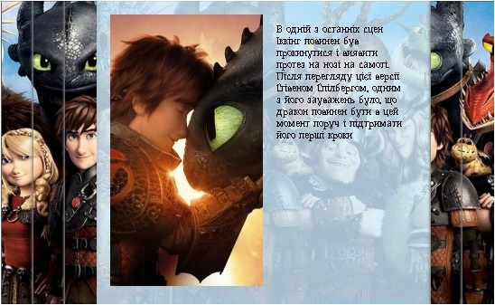

# Заняття 31

### **Вкладки в HTML та CSS**  

Вкладки – це спосіб **структурувати контент** на веб-сторінці, дозволяючи користувачам перемикатися між різними секціями без перезавантаження сторінки.  

**Як це працює?**  

У HTML створюють кнопки (`tab`), які відповідають різним блокам контенту.  

За допомогою CSS приховують неактивні вкладки.  

У JavaScript можна зробити динамічне перемикання.  

**Приклад вкладок на HTML та CSS (без JS):**
```html
<style>
  .tabs { display: flex; gap: 10px; }
  .tab-content { display: none; padding: 10px; border: 1px solid #ccc; }
  #tab1:checked ~ .content1,
  #tab2:checked ~ .content2 {
    display: block;
  }
</style>

<div class="tabs">
  <label for="tab1">Вкладка 1</label>
  <label for="tab2">Вкладка 2</label>
</div>

<input type="radio" name="tabs" id="tab1" hidden checked>
<input type="radio" name="tabs" id="tab2" hidden>

<div class="tab-content content1">Контент 1</div>
<div class="tab-content content2">Контент 2</div>
```

При кліку на вкладку змінюється видимий блок контенту!  


## Завдання

Необхідно створити інтерактивний блок, який міститиме галерею цікавих фактів про популярний анімаційний фільм "Як приборкати дракона". Галерея повинна мати можливість перемикання між різними фактами за допомогою радіокнопок, оформлених як мініатюри зображень.

### Вимоги до галереї

#### Загальна структура
1. Створіть секцію з класом "about_film", яка буде вміщувати всю галерею.
2. Галерея повинна містити 5 фактів про мультфільм.
3. Кожен факт складається з зображення та текстового опису.
4. Перемикання між фактами здійснюється за допомогою радіокнопок з відповідними мініатюрами.

#### Радіокнопки та ярлики
1. Створіть 5 радіокнопок з атрибутами:
   - Тип: "radio"
   - Ім'я: "datas" (однакове для всіх кнопок для групування)
   - ID: від "data1" до "data5"
   - П'ята радіокнопка має бути обрана за замовчуванням (додайте атрибут checked="checked")

2. Для кожної радіокнопки створіть ярлик (тег label):
   - З атрибутом "for", що відповідає ID радіокнопки
   - Всередині ярлика розмістіть мініатюру (тег img) з шляхом до зображення "images/piece[номер].jpg"

#### Інформаційні блоки
1. Після кожної пари радіокнопка-ярлик створіть div-блок, який міститиме:
   - Зображення (тег img) з повною версією факту
   - Абзац тексту (тег p) з описом цікавого факту

2. Розташуйте вміст інформаційних блоків у наступному порядку:

   **Факт 1:**
   - Зображення: "images/about_1.jpg"
   - Текст: "При анімації першої зустрічі Іккінга і Беззубіка є такий момент: камера плавно рухається справа наліво і видно, що око дракона закрите, потім на мить голову затуляє крило і коли камера зсувається ще вліво, око вже відкрите. Це насправді було помилкою анімації, настільки вдалою, що її так і залишили."

   **Факт 2:**
   - Текст: "Більшість драконів намальовано за мотивами птахів і плазунів. Однак для Нічної Фурії натхненням послужила чорна пантера. Головний аніматор, який відповідав за Беззубика спеціально перед початком зйомок завів кішку і наділив Беззубика багатьма її рисами."
   - Зображення: "images/about_2.jpg"

   **Факт 3:**
   - Зображення: "images/about_3.jpg"
   - Текст: "В одній з останніх сцен Іккінг повинен був прокинутися і виявити протез на нозі на самоті. Після перегляду цієї версії Стівеном Спілбергом, одним з його зауважень було, що дракон повинен бути в цей момент поруч і підтримати його перші кроки"

   **Факт 4:**
   - Зображення: "images/about_4.jpg"
   - Текст: "В оригінальній версії Астрід не існує - сильний жіночий персонаж був введений для розвитку романтичної лінії і «разбавкі» чоловічій компанії (як і дівчинка-близнюк Забіяка, яка, до слова сказати, з цієї почесної роллю справляється слабо)."

   **Факт 5:**
   - Зображення: "images/about_5.jpg"
   - Текст: "Нелегким завданням виявилося і створення образу Стоїка через велику кількість рослинності на обличчі. Здавалося абсолютно неможливим передати емоції вождя племені кошлатий Хуліганів, що було необхідною умовою розвитку сюжету в першій і другій частинах анімаційної саги. Команда DreamWorks Animation протягом багатьох годин вивчала виразу очей і руху вусів гномів з «Володаря кілець» і інших фільмів. Ця робота не залишилася непоміченою: глядачі запам'ятали Стоїка як сильного персонажа, що виражає свої емоції по більшій мірі жестами."

--- 

#### Приклад блоку сторінки:


