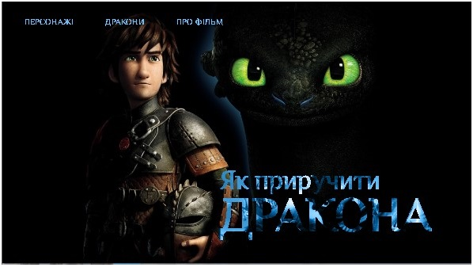

# Заняття 32

## Режим накладання блоків

Режим накладання (`z-index`) визначає, який елемент **буде розташований поверх інших**. Це особливо корисно для модальних вікон, спливаючих підказок і шарів у веб-дизайні.  

**Основні принципи:**  

`z-index` – керує порядком розташування елементів (чим більше значення, тим вище елемент).  

`position: absolute | relative | fixed` – працює разом із `z-index`, визначаючи, чи елемент можна переміщати.  

`opacity`, `visibility`, `display` – впливають на відображення накладених елементів.  

**Приклад:**
```html
<style>
  .container { position: relative; width: 200px; height: 200px; }
  .box1 { position: absolute; width: 100px; height: 100px; background: red; z-index: 1; }
  .box2 { position: absolute; width: 100px; height: 100px; background: blue; left: 30px; top: 30px; z-index: 2; }
</style>

<div class="container">
  <div class="box1"></div>
  <div class="box2"></div>
</div>
```

---

## Завдання

Ваше завдання - створити привабливу та функціональну шапку (header) сайту, яка міститиме навігаційне меню та назву мультфільму з ефектним оформленням.

### Вимоги до шапки сайту

#### Загальна структура
1. Створіть блок `<header>`, який буде містити всі елементи шапки сайту.
2. Шапка має включати в себе:
   - Навігаційне меню
   - Назву мультфільму з ефектом накладання тексту

#### Навігаційне меню
1. В межах шапки створіть елемент `<nav>`, що міститиме навігаційне меню сайту.
2. Всередині елементу навігації створіть ненумерований список `<ul>`.
3. Список повинен містити 3 пункти меню:
   - "ПЕРСОНАЖІ"
   - "ДРАКОНИ"
   - "ПРО ФІЛЬМ"
4. Кожен пункт меню має бути оформлений як елемент списку `<li>`.
5. Всі пункти меню повинні бути посиланнями `<a>` з атрибутом `href="#"` (тимчасові посилання, які згодом будуть оновлені).
6. Текст усіх пунктів меню має бути написаний великими літерами.

#### Назва мультфільму
1. Після навігаційного меню розмістіть назву мультфільму у вигляді двох накладених один на одного текстових блоків:
   - Перший блок з класом "text_back" - для фонового тексту
   - Другий блок з класом "text_front" - для переднього тексту
2. Обидва блоки повинні містити однаковий текст: "Як приручити" з переносом рядка та слово "ДРАКОНА", яке має бути обгорнуте в тег `<span>`.
3. Текст "Як приручити" повинен бути написаний з великої літери, а слово "ДРАКОНА" має бути повністю великими літерами (всередині тегу `<span>`).

---

#### Приклад завдання


